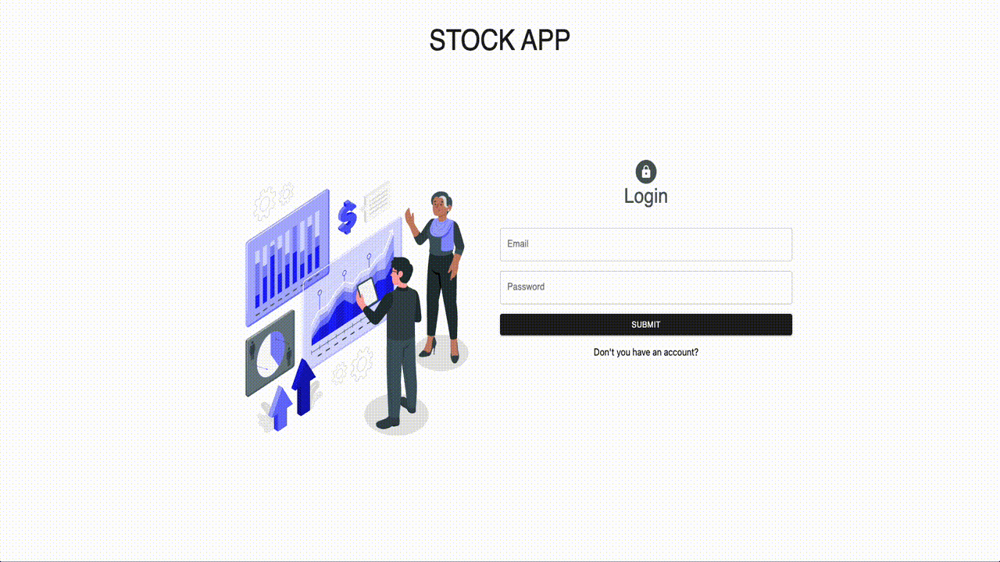

# Stock App

## Description

Project aims to create a Stock App which requires user login and you can follow your sales, purchases, products and business partners of your company.

### Following topics are covered;

- ReactJS, Redux, Redux Toolkit, Redux Persist, Axios, Material UI, Formik, Yup, Toastify, Emotion/react, Tremor/react

## Outcome



## Project Skeleton

```
 Stock App (folder)
|
|---readme.md
├── public
│    ├── favicon.ico
│    ├── index.html
│    └──  manifest.json
├── src
│    ├── app
│    │     └── store.jsx
│    ├── assets
│    │     ├── loading.gif
│    │     └── result.svg
│    ├── features
│    │     ├── authSlice.jsx
│    │     └── stockSlice.jsx
│    ├── helper
│    │     └── ToastNotify.js
│    ├── hooks
│    │     ├── useAuthCall.jsx
│    │     ├── useAxios.jsx
│    │     └── useStockCall.jsx
│    ├── components
│    │     ├── modals
│    │           ├── BrandModal.jsx
│    │           ├── FirmModal.jsx
│    │           ├── ProductModal.jsx
│    │           ├── PurchaseModal.jsx
│    │           └── SaleModal.jsx
│    │     ├── BrandCard.jsx
│    │     ├── Charts.jsx
│    │     ├── FirmCard.jsx
│    │     ├── KPICards.jsx
│    │     ├── LoginForm.jsx
│    │     ├── MenuListItems.jsx
│    │     ├── ProductCard.jsx
│    │     └── RegisterForm.jsx
│    ├── styles
│    │     └── globalStyle.jsx
│    ├── helper
│    │     └── ToastNotify.js
│    ├── pages
│    │     ├── Brands.jsx
│    │     ├── Dashboard.jsx
│    │     ├── Firms.jsx
│    │     ├── Home.jsx
│    │     ├── Register.jsx
│    │     ├── Login.jsx
│    │     ├── Products.jsx
│    │     ├── Purchases.jsx
│    │     └── Sales.jsx
│    ├── router
│    │     ├── AppRouter.jsx
│    │     └── PrivateRouter.jsx
│    ├── App.js
│    ├── index.js
│    └── index.css
├── package.json
├── postcss.config.js
├── tailwind.config.js
└── yarn.lock
```
